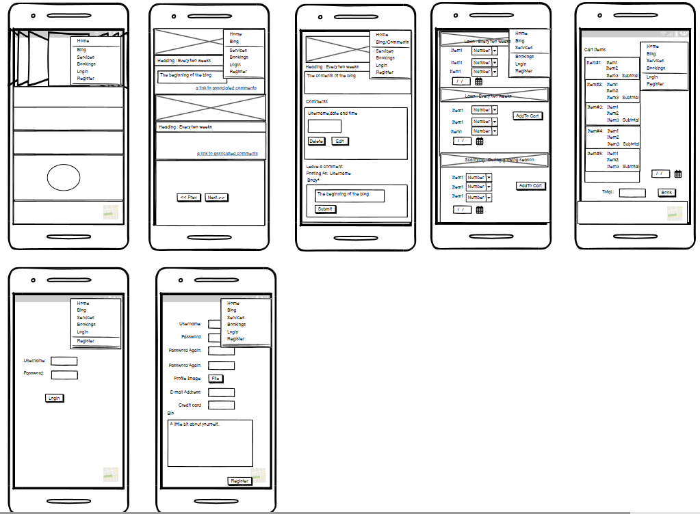

# Harmonia

## OverView

"Harmonia" is my capstone assessed portfolio project, developed as part of the Code Institute Full Stack Software Developer Bootcamp. 
This project showcases my skills in HTML5, CSS3, Bootstrap and Python with augmented AI to create a responsive, accessible website to -
 1. Promoting chemical free gardening and services available locally.
 2. A blog containing tips aimed at both amateur and professional to foster better practices and behaviours. 
  The name Harmonia is actually co-pilot inspired.
 3. Booking Services offered complete with costings 

The temporary live project can be found here: <a href="https://pio-o-connell.github.io/Individual/">Harmonia</a>

<h2 align="center" id="TOC">Index</h2>

- [Harmonia](#harmonia)
  - [OverView](#overview)
  - [UX Design Process](#ux-design-process)
    - [User Stories](#user-stories)
    - [Wireframes](#wireframes)
    - [Colour Scheme](#colour-scheme)
    - [Fonts](#fonts)
  - [Features](#features)
  - [Improvements](#improvements)
  - [Deployment](#deployment)
  - [Testing and Validation](#testing-and-validation)
  - [AI Implementation](#ai-implementation)
  - [Database](#database)
  - [References](#references)
  - [Tech Employed](#tech-employed)
  - [Learning Points](#learning-points)

## UX Design Process

    
Project Board
    

    <a href="https://github.com/users/pio-o-connell/projects/9">GitHub Project Board</a>

### User Stories

    
Details
    

    1. Authentication & Profiles
       - As a SuperUser, I want to manage users, services, and bookings efficiently.
       - As a SuperUser, SuperUser, I can edit profiles so that I can keep user information up to date
       - As a SuperUser, I can moderate blogs and comment ensuring content both relevant and appropriate
       - As a User, As a User, I can succesfully log in so that so I can securely edit blogs/comments
       - As a Guest, I can register so that so I can securely edit contribute blogs/comments

    2. Blog Management
        - Registered User can create blogs adding to gardening knowledge pool
        - Guest can read all blogs 
        - Registered User can update their blogs
        - Registered User can delete their blogs

    3. Comment Management
        - Visiting guest can create comment adding to blog's knowledge pool
        - Visiting guest can read comment 
        - Returning visiting guest or registered User can update their comments
        - Returning visiting guest or registered User can delete their comments

    4. Shopping Cart / Booking creation
        - Visiting guest can create shopping cart persisted in stored cookies or session data. 
        - Visiting guest can create Booking to complete transaction . Information retrieved from stored cookies or session data.
        - Registered user can create shopping cart 
        - Registered user can create Booking to complete transaction . Information retrieved from Shopping Cart

    5. Booking Management
        - As a SuperUser,  I can approve bookings. Information retrieved from Bookings.

### Wireframes

    
 Mobile pages logged in
    

    

    
 Mobile pages logged out
    

    

### Colour Scheme

Colour Palette & Design Choices

I used one **PRIMARY** colour for all text, a **SECONDARY** colour for the Call to Action, and whitespace appropriately.  
The main page uses the **rule of thirds** for a balanced composition.  
Colours were selected using [Image Color Picker](https://imagecolorpicker.com/).

| Main Palette       | Hex       | Usage                                   |
|-------------------|-----------|----------------------------------------|
| Flax              | #E9D98A   | Background                              |
| Dark Moss Green   | #506D1B   | CTA / Secondary colour                  |
| Ecru              | #C9B66B   | Highlight links / hover effects         |
| Eggshell          | #E6E2D2   | Background areas or cards               |
| Davy’s Grey       | #4D4D4D   | Primary colour / text                   |

Accessibility checks were done with [Colour Contrast Checker](https://colourcontrast.cc/), [WebAIM](https://webaim.org/resources/contrastchecker/), and [Adobe Color](https://color.adobe.com/create/color-contrast-analyzer).

Click to view Colour Contrast Checker results

[View live responsiveness](https://ui.dev/amiresponsive?url=https://pio-o-connell.github.io/Individual/index.html)

Click to view WebAIM results

[View live responsiveness](https://ui.dev/amiresponsive?url=https://pio-o-connell.github.io/Individual/index.html)

Click to view Adobe Color results

[View live responsiveness](https://ui.dev/amiresponsive?url=https://pio-o-connell.github.io/Individual/index.html)

### Fonts

    
Details
    

    Similar to colour, the font should be easy to read. Thus one font is only necessary i.e. for titles, body, and a call to actiob(CTA). These were implemnted through Google Fonts using a direct import code within the style.css file.

/_ Google fonts import _/ @import url('https://fonts.googleapis.com/css2?family=Inter:wght@100..900&family=Macondo&display=swap');

Inter was used everywhere.

[Back To Top](#harmonia)

## Features
--- 

    
Details
    

        ### Landing page

        ### Login
                ### Admin Login

                ### User Login

        ### Register

        ### Logout

        ### Blog CRUD

        ### Comment CRUD

        ### Services \ Add To Cart

        ### Booking

        ### Custom Error pages

            #### 404 Page Not Found

            #### 403 Access Denied

            #### 500 Server Error

 

[Back To Top](#harmonia)

## Improvements
--- 

    
Details
    
    [Click to view live responsiveness](https://ui.dev/amiresponsive?url=https://pio-o-connell.github.io/Individual/index.html)  

 

[Back To Top](#harmonia)

## Deployment
---

    
Details
    

    
      This [GitHub](https://github.com/) project was created using the [Code Institute Template](https://github.com/Code-Institute-Org/ci-full-template) ensuring all necessary dependencies.

      Setup a repo using this method and template:

            1. Login to your GitHub profile.
            2. Navigate to the Code Institute Full Template
            3. Click the dropdown for 'Use this template' and select "Create a new repository"
            4. Generate the necessary name and description for your repo and click 'Create repository from template'
            5. Navigate to the new repo and click the green 'Open' button with the Gitpod logo 
              **IMPORTANT - This button should only be clicked once to generate the new IDE workspace**
            6. You can now work on your repository within the Code Institute Gitpod IDE workspace
    
            Once the project repo is created, an early deployment for the live project should performed. 
            This allows for early and continuous testing using a variety of devices, as well as the Dev Tools available within browsers.

            Additional information on the deployment process can be found on the official [GitHub Docs](https://docs.github.com/en/pages/quickstart)

[Back To Top](#harmonia)

## Testing and Validation
---

    
Details

        ### HTML Validation

        ### CSS Validation

        ### Python Validation

        ### JS Vsalidation

        ### LightHouse

        ### Wave

        ### Unit Testing scripting

      ### Harmonia Application Testing Matrix

[Back To Top](#harmonia)

## AI Implementation
--- 

    
Details

    ### Code Creation

    ### Debugging

    ### Performance and Experience

    ### Development Process
    
    
    
    
    [Click to view live responsiveness](https://ui.dev/amiresponsive?url=https://pio-o-connell.github.io/Individual/index.html)  

[Back To Top](#harmonia)

## Database
--- 

    
Details
    

    The database is a Postgres database hosted by Code institute

    
  
   

[Back To Top](#harmonia)

## References
--- 

Details

  <h4>Documentation</h4>
  <ul>
      <li>
          <a href="https://docs.djangoproject.com/en/5.2/ref/models/querysets/" target="_blank">
              Django documentation – very useful for several sections
          </a>
      </li>
  </ul>

  <h4>W3Schools</h4>
  <ul>
      <li>
          <a href="https://www.w3schools.com/python/python_lists_comprehension.asp" target="_blank">
              Reminder on how list comprehension works
          </a>
      </li>
  </ul>

  <h4>Old Projects</h4>
  <ul>
      <li>
          <a href="https://github.com/pio-o-connell/Individual" target="_blank">
              GitHub – Older project reference
          </a>
      </li>
  </ul>

    

[Back To Top](#harmonia)

## Tech Employed
--- 

  
Technologies and Languages

  <h3>Languages</h3>
  
  
  
  

  <h3>Libraries and Frameworks</h3>
  
    
    

  <h3>Tools and Programs</h3>
  
  
  
    
    
    
    
    

[Back To Top](#harmonia)
## Learning Points
--- 

    
Details
    

    
    [Click to view live responsiveness](https://ui.dev/amiresponsive?url=https://pio-o-connell.github.io/Individual/index.html)  

[Back To Top](#harmonia)

